#**Brain MRI Segmentation**

This is my first project about segmentation. The gobal of thís  project is 
segmenting tumors on Brain image. Currently, it achieves 0.86 IoU. 

The architecture is inspired by [U-Net: Convolutional Networks for Biomedical Image Segmentation](https://lmb.informatik.uni-freiburg.de/people/ronneber/u-net/)

Some results:

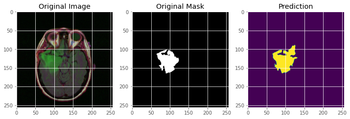

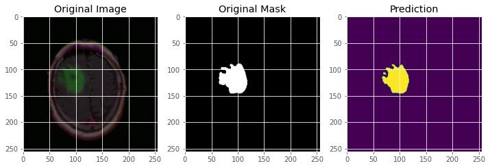
##1. Data
**LGG Segmentation Dataset**

- Dataset used in:
    - Mateusz Buda, AshirbaniSaha, Maciej A. Mazurowski "Association of genomic subtypes of lower-grade gliomas with shape features automatically extracted by a deep learning algorithm." Computers in Biology and Medicine, 2019.
    - Maciej A. Mazurowski, Kal Clark, Nicholas M. Czarnek, Parisa Shamsesfandabadi, Katherine B. Peters, Ashirbani Saha "Radiogenomics of lower-grade glioma: algorithmically-assessed tumor shape is associated with tumor genomic subtypes and patient outcomes in a multi-institutional study with The Cancer Genome Atlas data." Journal of Neuro-Oncology, 2017.
- This dataset contains brain MR images together with manual FLAIR abnormality segmentation masks.
- Files in Dataset are [.tif](https://en.wikipedia.org/wiki/TIFF) files.

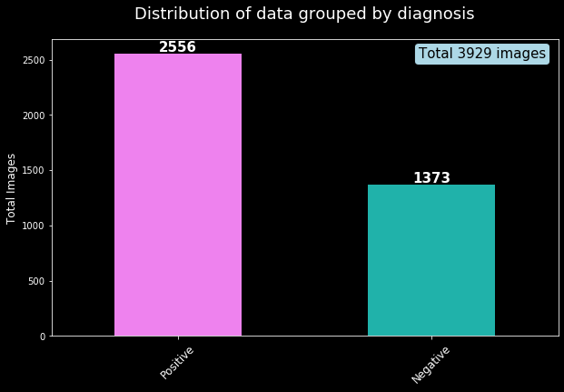

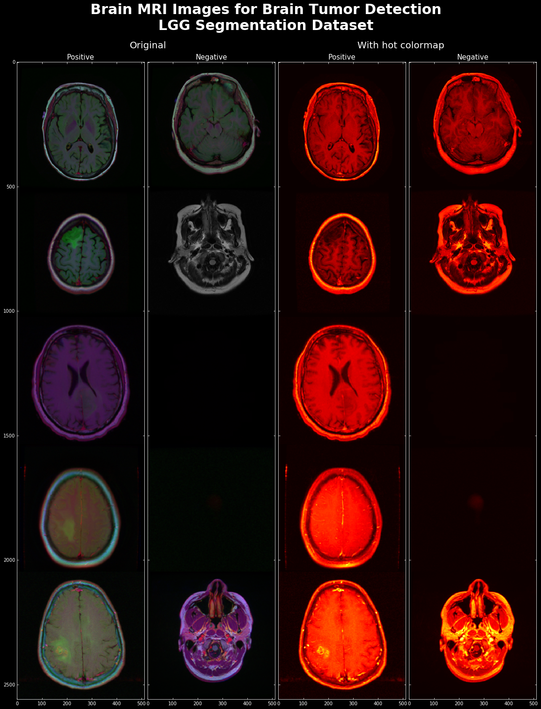

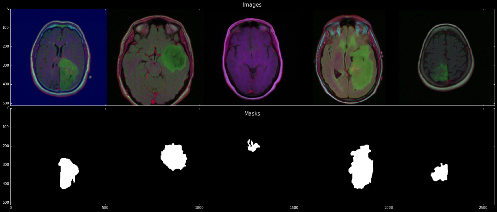

##2. Preprocessing.
- Keep brain images is RGB because I think with 3 channels R-G-B, information about tumors is different from the rest. About mask images is gray.
- Bring image's pixel to between 0 and 1 and mask's pixel are 0 or 1 (0 when pixel / 255 < 0.5, 1 when pixel / 255 >= 0.5).
- Split data into 3 part: Train, Validation and Test:
    + Train: 2828 images, masks (71.98%)
    + Validation: 708 images, masks (18.02%)
    + Test: 393 images, masks (10%)
##3. Model, loss function, optimizer and metric
###3.1 Model Architecture

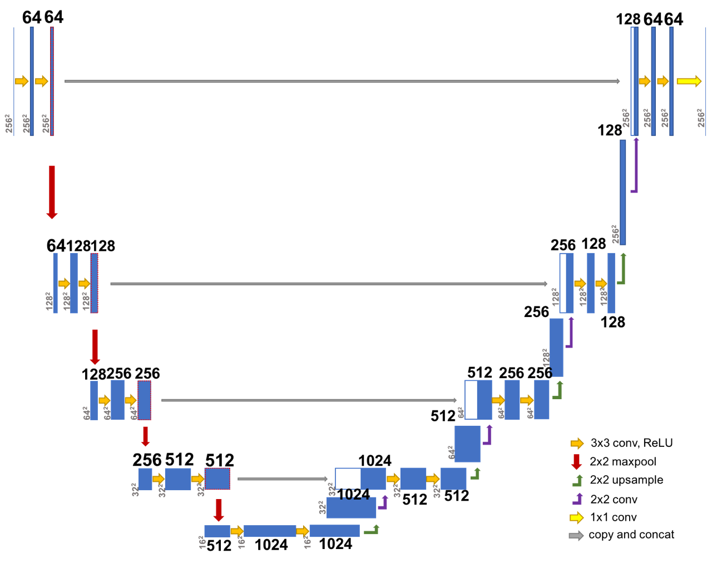

- Input shape: (256,256,3)
- Output shape: (256,256,1)
- Conv is a convolutional layer (convolution kernel is 3 × 3 and padding is 1).
- Use batch normalization between convolutional layer and Activation function is ReLU.
- Upsample is the transposed convolution.
###3.2 Loss function

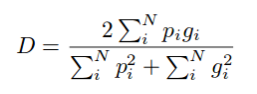

**[Dice coefficient loss function](https://en.wikipedia.org/wiki/S%C3%B8rensen%E2%80%93Dice_coefficient)**

###3.3 Optimizer

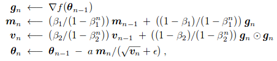

**Use [Adam](https://en.wikipedia.org/wiki/Stochastic_gradient_descent#Adam) with learning rate is 1e-4**

###3.4 Metrics

 
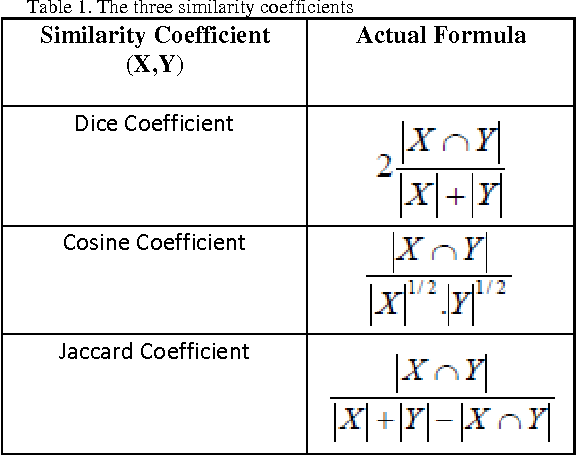

**- [Intersection over Union (IOU)](https://en.wikipedia.org/wiki/Jaccard_index)**

**- [Dice Coefficient](https://en.wikipedia.org/wiki/S%C3%B8rensen%E2%80%93Dice_coefficient)**

##4. Result

- The training process in Kaggle with 150 epochs,results are decribed below: 

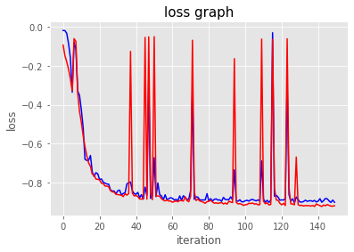

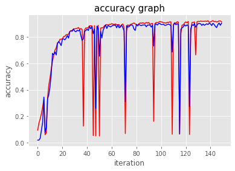

- Evaluated on test set 

Loss | Accuracy | IOU | Dice_coeff
---- | ----- | -------- | ------ 
-0.92058	| 0.9982	|0.85751|	0.92278

- Some predict results:

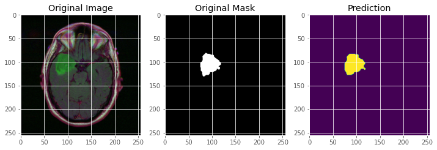

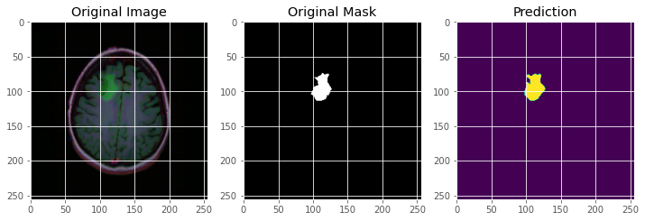

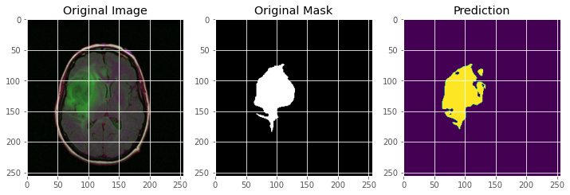

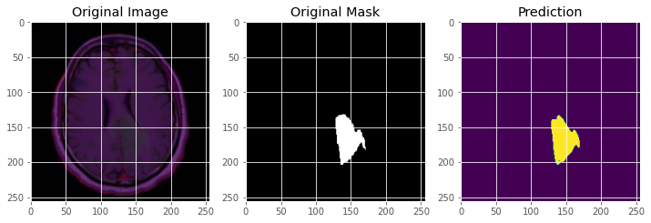

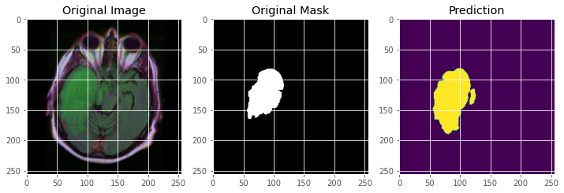

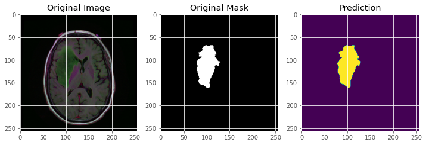

##5. Refercence

In the process of implementing the project, from sketching ideas to completing models, I have consulted a number of resources including scientific articles, github, .... Here are some examples that i think they have important role in the implementation of this topic:

- [UNet — Line by Line Explanation](https://towardsdatascience.com/unet-line-by-line-explanation-9b191c76baf5)
- [Brats Using U-net - KFolded](https://www.kaggle.com/mdbadiuzzamanshuvo/brats-using-u-net-kfolded)

